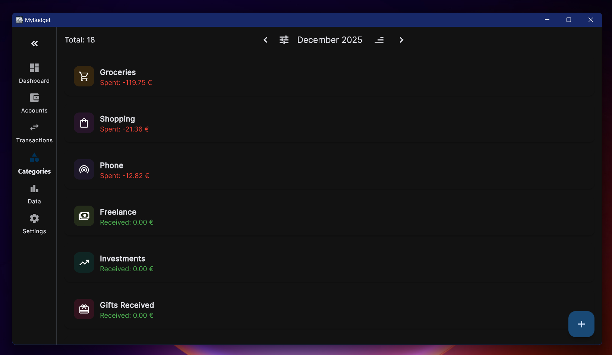
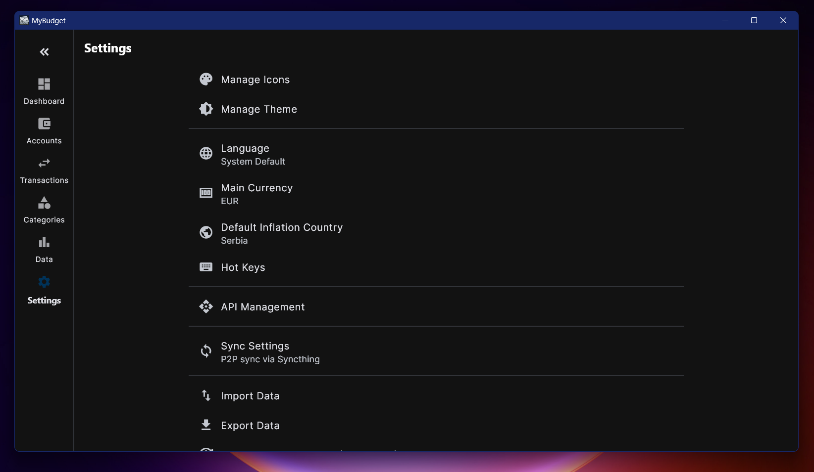

# MyBudget

MyBudget is a personal finance manager inspired by **OneMoney**. I created this project because the original app lacked certain features and flexibility that I needed for my daily financial tracking.

| Dashboard | Transaction Editor | Theme Switch |
|-----------|--------------------|--------------|
|  |  |  |

| Accounts | Categories | Trends | Settings |
|----------|------------|--------|----------|
|  |  |  |  |

---

## Features

- **Multi-Currency Dashboard**: Track all your accounts in one place.
- **Budget Analysis**: Record transactions and categorize them to identify weak spots in your budget.
- **Asset Tracking**: Link your Steam inventory, stocks, or any other asset to your net worth.
- **Deep Customisation**:
    - **Visuals**: Choose custom icons and colors for every account and category.
    - **Themes**: Light, Dark mode support.
    - **Workflows**: Map your own **Hotkeys** for every major action (Windows).
- **Disconnected Data**: Connect your own price/rate APIs so you aren't dependent on a single provider.

## Supported Languages

| Language | Code | Language | Code |
|----------|------|----------|------|
| English | `en` | Russian | `ru` |
| Arabic | `ar` | Portuguese | `pt` |
| Bengali | `bn` | Chinese | `zh` |
| Spanish | `es` | Hindi | `hi` |
| French | `fr` | Urdu | `ur` |

---

## 🔄 Synchronization

MyBudget supports two independent ways to keep your data in sync:

### 1. P2P Sync (Local Network)
Uses **Syncthing** technology. Perfect for maximum privacy and when you are on the same Wi-Fi. 
- **How it works**: Devices discover each other and swap data directly. No cloud or middleman involved.
- **Best for**: Syncing your phone and laptop while at home.

### 2. Sync Server (Anywhere)
A lightweight centralized server that allows you to sync even if your devices are never online at the same time.
- **How it works**: One device pushes changes to your private server; the other pulls them when it turns on.
- **Best for**: Robust syncing across different networks.

---

## 🛠️ Sync Server Setup

The server is distributed as a Docker container for the easiest installation.

### Installation
Pull and run the official image from GitHub Container Registry:

```bash
docker run -d \
  --name my_budget_sync \
  --restart always \
  -p 58080:58080 \
  -e PORT=58080 \
  -v ./mybudget_data:/app/data \
  ghcr.io/navi705/my_budget_server:latest
```


---

## 💻 Get the App

### Windows
- **Portable Version**: Extract the ZIP and run `my_budget_client.exe`.
- **Regular Version**: Single-file `.exe` installer that adds the app to your Start menu.

### Android
Download the latest `.apk` from the [GitHub Releases](https://github.com/navi705/MyBudget/releases).
