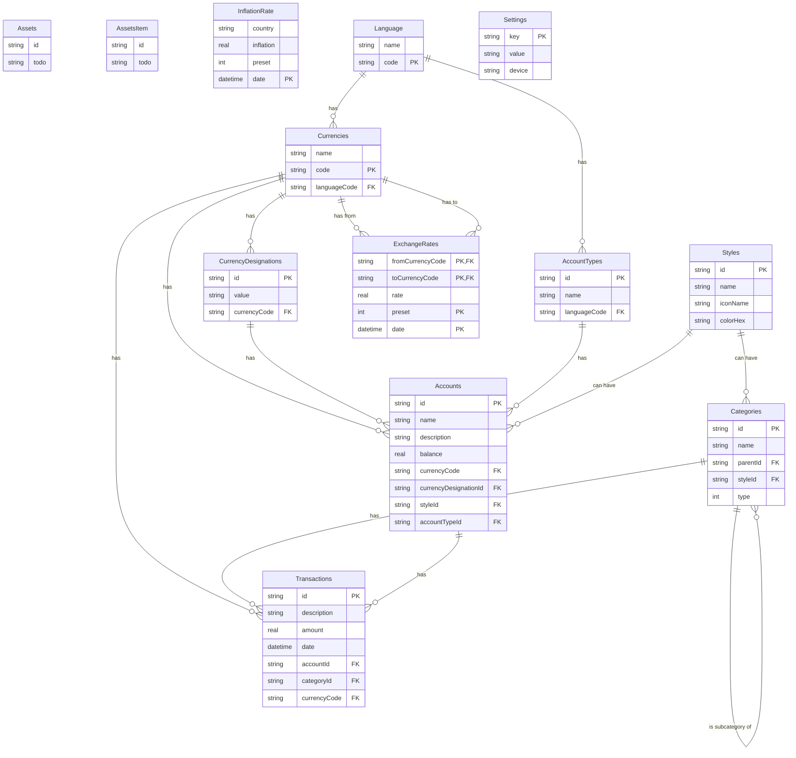

```mermaid
erDiagram
    Assets{
        string id 
        string todo
    }
    AssetsItem{
        string id
        string todo
    }

    InflationRate{
        string country
        real inflation
        int preset
        datetime date PK
    }

    Language{
        string name
        string code PK
    }

    Currencies {
        string name
        string code PK
        string languageCode FK
    }

    CurrencyDesignations {
        string id PK
        string value
        string currencyCode FK
    }

    Categories {
        string id PK
        string name
        string parentId FK
        string styleId FK
        int type
    }

    Styles {
        string id PK
        string name
        string iconName
        string colorHex
    }

    AccountTypes {
        string id PK
        string name
        string languageCode FK
    }

    Accounts {
        string id PK
        string name
        string description
        real balance
        string currencyCode FK
        string currencyDesignationId FK
        string styleId FK
        string accountTypeId FK
    }

    Transactions {
        string id PK
        string description
        real amount
        datetime date
        string accountId FK
        string categoryId FK
        string currencyCode FK
    }

    ExchangeRates {
        string fromCurrencyCode PK, FK
        string toCurrencyCode PK, FK
        real rate
        int preset PK
        datetime date PK
    }

    Settings {
        string key PK
        string value
        string device
    }

    Currencies ||--o{ CurrencyDesignations : "has"
    Currencies ||--o{ Accounts : "has"
    Currencies ||--o{ Transactions : "has"
    Currencies ||--o{ ExchangeRates : "has from"
    Currencies ||--o{ ExchangeRates : "has to"
    CurrencyDesignations ||--o{ Accounts : "has"
    AccountTypes ||--o{ Accounts : "has"
    Styles ||--o{ Categories : "can have"
    Styles ||--o{ Accounts : "can have"
    Categories ||--o{ Categories : "is subcategory of"
    Categories ||--o{ Transactions : "has"
    Accounts ||--o{ Transactions : "has"
    Language ||--o{ Currencies : "has"
    Language ||--o{ AccountTypes : "has"

```
