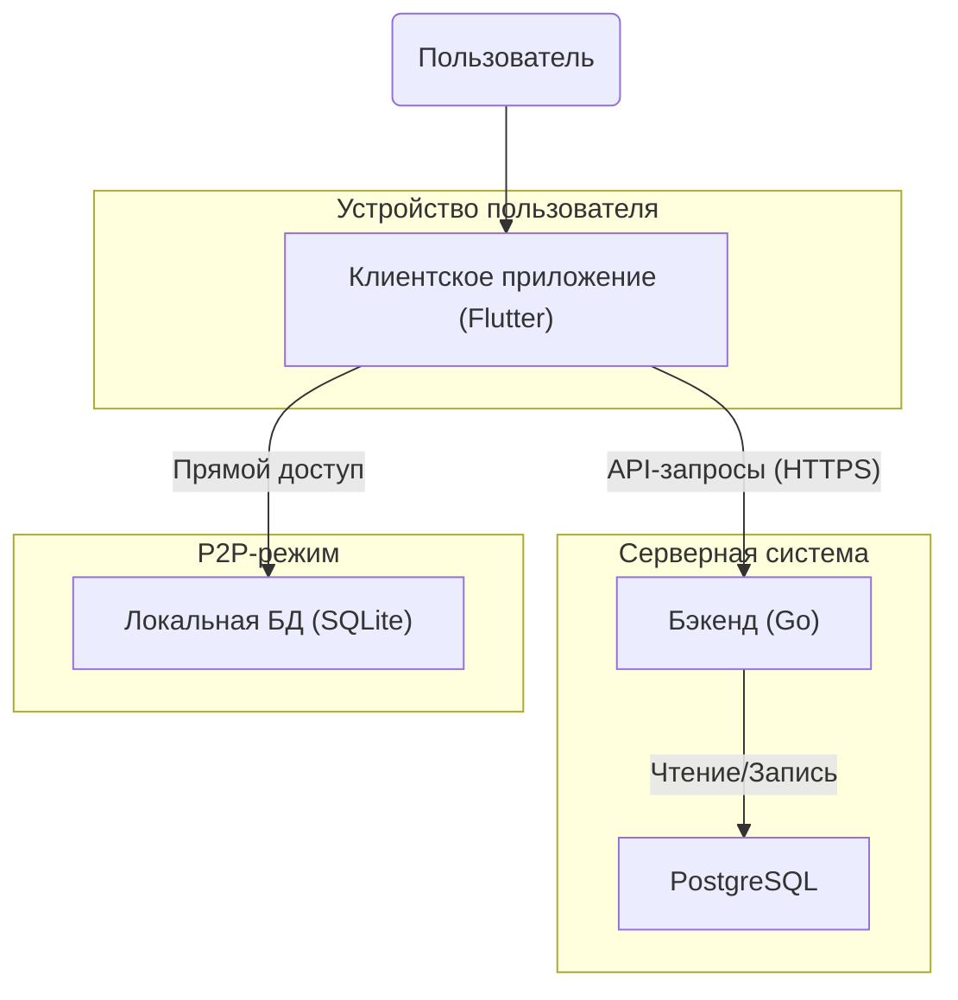
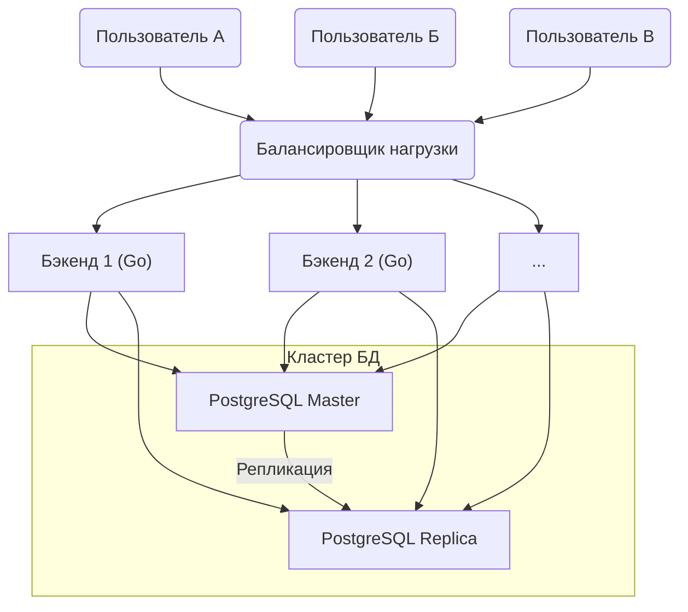
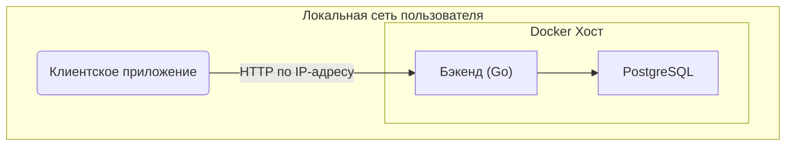
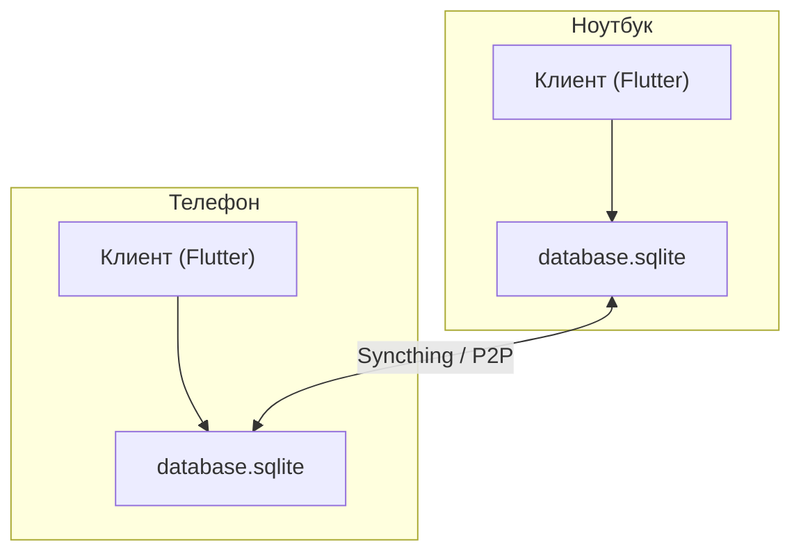

# Архитектура проекта "MyBudget"

Этот документ описывает высокоуровневую техническую архитектуру проекта, основанную на стеке **Flutter + Go**.

## 1. Общая схема компонентов

На самом высоком уровне система состоит из трех основных компонентов: Клиентского приложения, Бэкенда и Базы данных. Клиентское приложение может работать в двух режимах: напрямую с локальной базой данных (для P2P-сценария) или через API с бэкендом.

## 2. Архитектурные сценарии развертывания

Проект поддерживает три различных модели развертывания, чтобы предоставить пользователю максимальную гибкость.

### Сценарий 1: SaaS (Облачный сервис)

Это стандартная модель для максимального удобства пользователя. Архитектура рассчитана на высокую нагрузку и горизонтальное масштабирование.

### Сценарий 2: Self-Hosted (Локальный сервер)

Пользователь разворачивает серверную часть на своем оборудовании с помощью Docker. Клиентское приложение подключается к этому локальному серверу.

### Сценарий 3: P2P (Без сервера)

Для максимальной приватности. Бэкенд не используется. Синхронизация файла локальной базы данных осуществляется сторонним P2P-инструментом.

## 3. Архитектура компонентов

И клиент, и бэкенд будут построены с использованием принципов **Чистой Архитектуры (Clean Architecture)** для разделения бизнес-логики от деталей реализации.

*   **Клиент (Flutter):**
    *   **Data Layer:** Слой данных, отвечающий за получение информации. Будет содержать реализации репозиториев как для работы с локальной базой SQLite, так и для работы с REST API бэкенда.
    *   **Domain Layer:** Слой с основной бизнес-логикой, сценариями использования (Use Cases) и моделями. Не зависит ни от чего.
    *   **Presentation Layer:** UI-компоненты (виджеты), которые взаимодействуют с Domain Layer через state management (например, BLoC, Riverpod).

*   **Бэкенд (Go):**
    *   **Data Layer:** Реализация интерфейсов репозиториев для работы с PostgreSQL.
    *   **Domain Layer:** Основная бизнес-логика, полностью независимая от веба и базы данных.
    *   **API Layer:** Обработчики HTTP-запросов, которые принимают данные, вызывают соответствующий Use Case из Domain Layer и возвращают ответ.

## 4. Принцип Offline-First и Гибкость

Ключевым догматом проекта является **гибкость**, которая достигается через архитектурный подход **Offline-First**.

*   **Основа — локальная работа:** Приложение проектируется с расчетом на то, что оно **обязано** работать полностью автономно, без доступа к сети. Вся основная функциональность (создание и редактирование транзакций, просмотр отчетов) реализована для работы с локальной базой данных SQLite.
*   **Сеть — это улучшение, а не требование:** Подключение к бэкенду (SaaS или Self-Hosted) рассматривается как **опциональное улучшение** для синхронизации данных между устройствами, а не как необходимое условие для работы приложения.
*   **Пропуск аутентификации:** В клиентском приложении будет предусмотрена возможность пропустить экраны регистрации и входа. При выборе этого пути, приложение переключается в локальный режим, используя зашифрованный файл базы данных SQLite. Это дает пользователю полный контроль и не требует создания учетной записи для начала работы.

Такой подход гарантирует, что приложение останется функциональным даже при потере соединения и предоставляет пользователю полный контроль над своими данными, что соответствует основным принципам проекта.

## 5. Событийная модель (Event-Driven)

В дополнение к синхронной модели "запрос-ответ", в архитектуру закладывается асинхронный, событийный подход для обработки фоновых и некритичных задач.

*   **Принцип:** Вместо выполнения всех операций в рамках одного запроса, ключевые сервисы (например, сервис транзакций) после выполнения основной задачи будут публиковать события (например, `TransactionCreated`).
*   **Компоненты:**
    *   **Брокер сообщений:** Внутри `/internal/events` будет реализован интерфейс брокера. Для `self-hosted` версии это будет простая реализация в памяти, для `SaaS` — интеграция с RabbitMQ или NATS.
    *   **Воркеры (Подписчики):** Внутри `/internal/workers` будут находиться обработчики, которые подписываются на события и выполняют соответствующие действия (пересчет прогнозов, отправка уведомлений и т.д.).
*   **Преимущества:** Такой подход повышает отзывчивость, масштабируемость и расширяемость системы.

## 6. Будущая эволюция: CQRS

Текущая архитектура (Чистая Архитектура + Событийная модель) закладывает фундамент для дальнейшего перехода к паттерну **CQRS (Command Query Responsibility Segregation)**.

*   **Принцип:** Если в будущем производительность чтения сложных отчетов станет узким местом, мы сможем разделить наши модели и даже базы данных для операций записи (Commands) и чтения (Queries).
*   **Готовность:** Наша событийная модель позволит легко синхронизировать "базу для записи" с оптимизированной "базой для чтения". На начальном этапе этот паттерн не реализуется для сохранения простоты (принцип YAGNI).

## 5. Будущая эволюция: CQRS

Текущая архитектура (Чистая Архитектура + Событийная модель) закладывает фундамент для дальнейшего перехода к паттерну **CQRS (Command Query Responsibility Segregation)**.

*   **Принцип:** Если в будущем производительность чтения сложных отчетов станет узким местом, мы сможем разделить наши модели и даже базы данных для операций записи (Commands) и чтения (Queries).
*   **Готовность:** Наша событийная модель позволит легко синхронизировать "базу для записи" с оптимизированной "базой для чтения". На начальном этапе этот паттерн не реализуется для сохранения простоты (принцип YAGNI).
