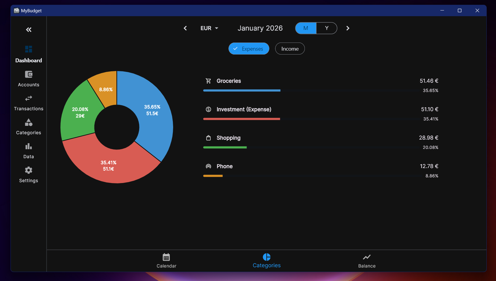
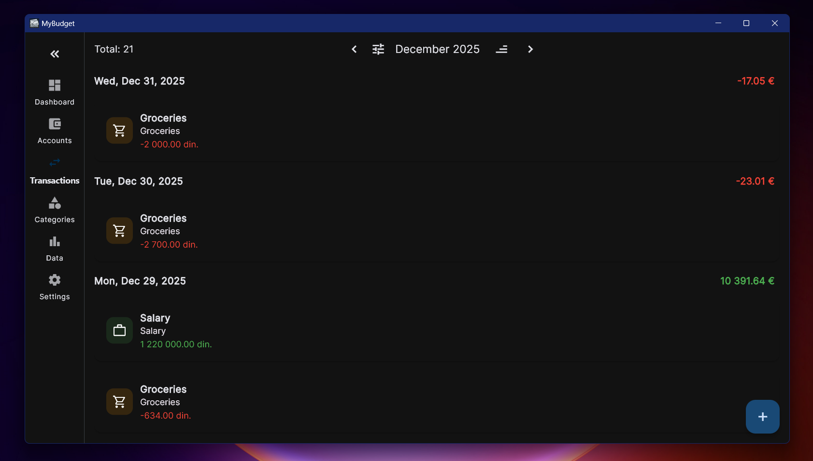
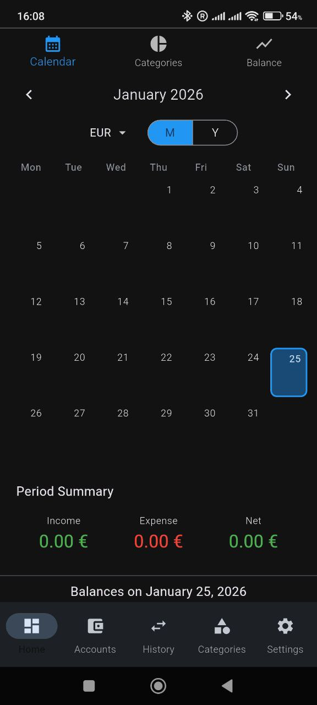
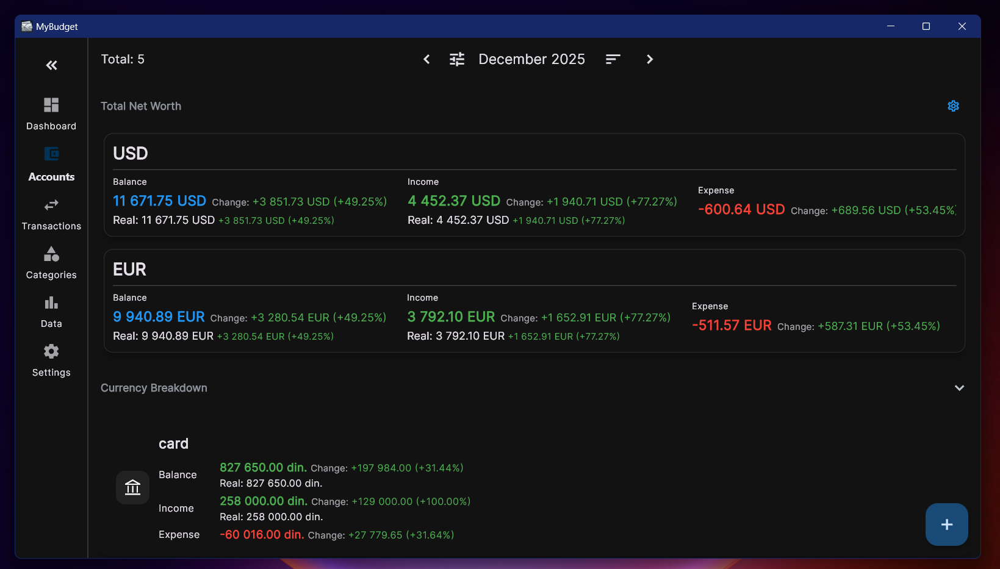
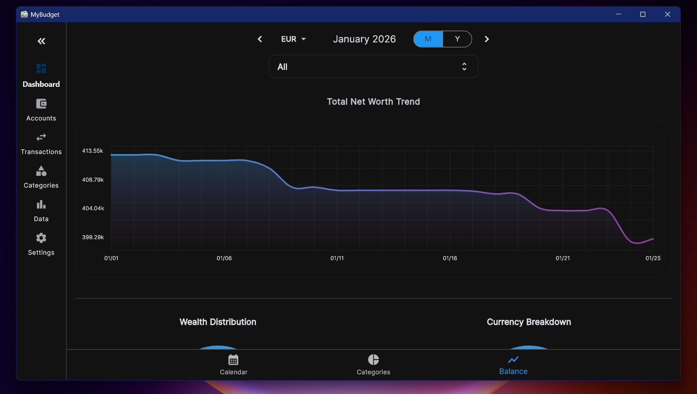

# MyBudget

MyBudget is a personal finance manager inspired by **OneMoney**. I created this project because the original app lacked certain features and flexibility that I needed for my daily financial tracking.

🌐 **[Open MyBudget Web](https://navi705.github.io/MyBudget/)**

| Dashboard | Transaction Editor | Theme Switch | Android |
|-----------|--------------------|--------------|---------|
|  |  |  | |

| Accounts | Categories | Trends | Settings |
|----------|------------|--------|----------|
|  |  |  |  |
---

## Features

- **Multi-Currency Dashboard**: Track all your accounts in one place.
- **Budget Analysis**: Record transactions and categorize them to identify weak spots in your budget.
- **Asset Tracking**: Link your Steam inventory, stocks, or any other asset to your net worth.
- **Deep Customisation**:
    - **Visuals**: Choose custom icons and colors for every account and category.
    - **Themes**: Light, Dark mode support.
    - **Workflows**: Map your own **Hotkeys** for every major action (Windows).
- **Disconnected Data**: Connect your own price/rate APIs so you aren't dependent on a single provider.

## Supported Languages

| Language | Code | Language | Code |
|----------|------|----------|------|
| English | `en` | Russian | `ru` |
| Arabic | `ar` | Portuguese | `pt` |
| Bengali | `bn` | Chinese | `zh` |
| Spanish | `es` | Hindi | `hi` |
| French | `fr` | Urdu | `ur` |

---

## 🔄 Synchronization

MyBudget supports two independent ways to keep your data in sync:

### 1. P2P Sync (Local Network)
Uses **Syncthing** technology. Perfect for maximum privacy and when you are on the same Wi-Fi. 
- **How it works**: Devices discover each other and swap data directly. No cloud or middleman involved.
- **Best for**: Syncing your phone and laptop while at home.

### 2. Sync Server (Anywhere)
A lightweight centralized server that allows you to sync even if your devices are never online at the same time.
- **How it works**: One device pushes changes to your private server; the other pulls them when it turns on.
- **Best for**: Robust syncing across different networks.

---

## 🛠️ Sync Server Setup

The server is distributed as a Docker container for the easiest installation.

### Installation (Docker Compose)
The server requires a PostgreSQL database to function. The easiest way to run both is using Docker Compose.

1. **Create a `docker-compose.yml` file**:
```yaml
version: '3.8'

services:
  server:
    image: ghcr.io/navi705/mybudget/my_budget_server:latest
    restart: always
    ports:
      - '58080:8080'
    environment:
      - DATABASE_URL=postgres://postgres:postgres@db:5432/my_budget
      - DART_FROG_ENV=production
    depends_on:
      db:
        condition: service_healthy

  db:
    image: postgres:15
    restart: always
    environment:
      POSTGRES_USER: postgres
      POSTGRES_PASSWORD: postgres
      POSTGRES_DB: my_budget
    ports:
      - '5432:5432'
    volumes:
      - db_data:/var/lib/postgresql/data
    healthcheck:
      test: ["CMD-SHELL", "pg_isready -U postgres -d my_budget"]
      interval: 5s
      timeout: 5s
      retries: 5

volumes:
  db_data:
```

2. **Start the server**:
```bash
docker-compose up -d
```


---

## 💻 Get the App

### Web (Browser)
The app is available as a **Progressive Web App** hosted on GitHub Pages:

🌐 **[Open MyBudget Web](https://navi705.github.io/MyBudget/)**

- **No installation required** — works directly in your browser
- **Data stored locally** — all your data is saved in your browser's IndexedDB
- **Private** — no data is sent to any server
- **Limitations**: Sync features and SMS import are not available in the web version

> **Note**: Each browser/device has its own separate local database. Data is not shared between different browsers or devices when using the web version.

### Windows
- **Installer**: Download and run `MyBudget-Setup.exe` to install the app.

### Android
Download the latest `.apk` from the [GitHub Releases](https://github.com/navi705/MyBudget/releases).

> **Android Installation (Bypass Play Protect)**:
> Since the app is self-signed, Google Play Project might block the installation. If the "Install anyway" button is missing or doesn't work:
> 1. Enable **Flight Mode** (disconnect all internet).
> 2. Go to Google Play Store settings -> **Play Protect** and try to disable "Scan apps with Play Protect". It often toggles off more easily without an internet connection.
> 3. Install the APK file while offline.
> 4. Once installed, you can re-enable your internet and Play Protect settings.

**SMS Import Support**:
To use the transaction import feature from SMS, you must manually grant permissions in Android settings:
1. Go to **Settings** -> **Apps** -> **MyBudget**.
2. Open **Permissions** and allow **SMS** access.
3. Some devices might also require enabling "Service SMS" or "Premium SMS" in special app access settings.

